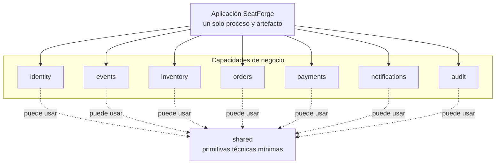
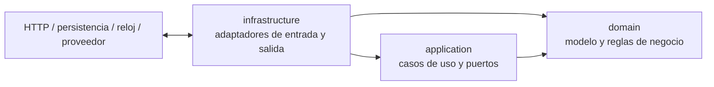

# Módulos y dependencias permitidas

Este documento define los límites estáticos de SeatForge durante su etapa de
monolito modular. La estructura desplegable es una sola aplicación Spring Boot
bajo el paquete base `com.jarl.seatforge`.

## Mapa de módulos



El diagrama no concede dependencias directas entre capacidades. Cuando una
historia necesite colaboración entre módulos, el consumidor solo podrá apuntar
al contrato público del proveedor en `application.port.in`, ya sea un puerto
invocable o un evento de integración inmutable. Cada dependencia concreta deberá
aparecer en este documento cuando se introduzca.

## Arquitectura dentro de cada módulo



La dirección de las flechas representa dependencias de código fuente, no el
flujo de datos en ejecución.

Estructura de referencia:

```text
com.jarl.seatforge.<module>
├── domain
│   ├── model
│   ├── service
│   └── event
├── application
│   ├── port
│   │   ├── in
│   │   └── out
│   └── usecase
└── infrastructure
    ├── web
    ├── persistence
    └── messaging
```

No todos los directorios deben existir desde el primer día. Solo se crean cuando
alojan una abstracción o implementación real.

## Superficie pública de un módulo

- `application.port.in` es la única superficie de código que otro módulo puede
  importar; incluye puertos invocables y contratos de eventos de integración.
- Los comandos, consultas y resultados que formen parte de esa API viven junto
  al puerto de entrada y no exponen agregados ni entidades de persistencia.
- `domain`, `application.usecase`, `application.port.out` e `infrastructure` son
  detalles internos y no se consumen desde otro módulo.
- Un repositorio es un puerto de salida del módulo propietario. Nunca es una API
  de integración ni se inyecta en otro módulo.
- Las tablas pertenecen al módulo que las escribe. Compartir una base de datos
  durante esta etapa no autoriza consultas o escrituras cruzadas.

## Comunicación mediante eventos en memoria

Los efectos secundarios desacoplados, como notificación y auditoría, pueden
reaccionar a eventos publicados dentro del proceso. El contrato del evento vive
en `application.port.in` del módulo productor. Los eventos puramente internos
pueden permanecer en su dominio, pero no se importan desde otro módulo.

- El productor publica hechos de negocio, no entidades mutables ni objetos JPA.
- El consumidor no importa clases internas del productor.
- Publicar en memoria no implica consistencia eventual distribuida ni justifica
  introducir Kafka en esta etapa.
- Si un efecto debe ocurrir después de confirmar una transacción, esa garantía
  se hace explícita y se prueba; el evento no puede observar un estado revertido.

## `shared` como shared kernel mínimo

`shared` solo admite primitivas técnicas estables que realmente necesiten varios
módulos, por ejemplo abstracciones de tiempo o correlación. No admite:

- agregados, estados o reglas pertenecientes a una capacidad;
- DTOs usados para evitar diseñar la API pública del proveedor;
- repositorios genéricos de negocio;
- utilidades sin consumidores reales.

Una dependencia hacia `shared` se revisa con más rigor que una duplicación
pequeña: ampliar el shared kernel aumenta el acoplamiento de todos los módulos.

## Matriz de dependencias

| Origen | Destino permitido | Destino prohibido |
|---|---|---|
| `<module>.domain` | Java, código del mismo `domain` y primitivas de `shared` estrictamente necesarias | Spring, JPA, HTTP, `application`, `infrastructure`, otro módulo de negocio |
| `<module>.application` | Su `domain`, puertos públicos `application.port.in` de otro módulo, `shared` mínimo | Infraestructura o repositorios/modelos internos ajenos |
| `<module>.infrastructure` | Su `application`, su `domain`, `shared` mínimo | Infraestructura, repositorios, tablas o dominio interno de otro módulo |
| Cualquier módulo consumidor | Puerto o contrato de evento del proveedor bajo `application.port.in` | `domain`, `port.out`, `usecase`, adaptadores, entidades JPA y tablas del proveedor |
| `shared` | Java y primitivas propias | Cualquier módulo de negocio o framework |

Estas reglas son *fitness functions*: las pruebas ArchUnit deben fallar cuando
una dependencia las incumpla. El job de CI ejecuta esas pruebas junto con el
resto de la suite.

## Cambiar este mapa

Una dependencia nueva exige:

1. identificar el caso de uso consumidor y el módulo propietario de la
   capacidad;
2. definir un puerto de entrada o evento con lenguaje de negocio;
3. descartar acceso directo a datos y ciclos entre módulos;
4. actualizar este diagrama y las pruebas ArchUnit en el mismo cambio;
5. registrar un ADR si la decisión altera los límites o las garantías del
   sistema.
