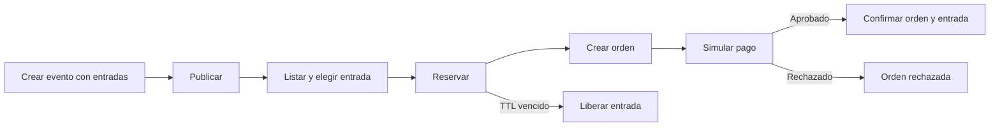

# Backlog mínimo de historias — SeatForge

SeatForge no pretende ser un producto comercial. Es un **laboratorio de backend**:
primero se construye una API REST pequeña dentro de un monolito modular y después
se usa para medir concurrencia, TPS, latencia, saturación, resiliencia y criterios
de extracción a microservicios.

## Principios de alcance

1. Construir un solo flujo: publicar evento → reservar entrada → crear orden →
   simular pago → confirmar venta.
2. Mantener únicamente reglas que permitan estudiar integridad, idempotencia,
   transacciones y carga.
3. No implementar funciones propias de un producto real si no habilitan un
   experimento técnico.
4. La API HTTP es el contrato de entrada; su contrato está en
   [`../api/openapi.yaml`](../api/openapi.yaml).
5. Antes de extraer un módulo se debe medir el monolito y documentar el motivo.

## Alcance funcional mínimo

- Dos actores de laboratorio: `ORGANIZER` y `BUYER`.
- Un evento tiene nombre, fecha, precio y una cantidad de entradas numeradas.
- El organizador crea y publica; no hay edición, zonas, mapas ni cancelación.
- El comprador lista eventos, elige una entrada, la reserva y crea una orden.
- Un pago simulado aprueba, rechaza o produce timeout.
- Una aprobación confirma orden y entrada en una transacción local.
- Un proceso interno libera reservas expiradas.

## Fuera de alcance

- Registro de usuarios, proveedor OAuth/OIDC, administración de perfiles o UI.
- Recintos, zonas, mapas de asientos, promociones, impuestos o múltiples monedas.
- Cancelaciones, reembolsos, reconciliación, notificaciones y API de auditoría.
- Kafka, Redis, API Gateway, Kubernetes y microservicios durante esta etapa.
- SLA comerciales o perfiles de carga gigantes definidos sin baseline previo.

## Clasificación

- **NÚCLEO:** se implementa para completar o medir el flujo mínimo.
- **ABSORBIDA:** su regla mínima se implementa dentro de otra historia; no crea
  endpoint ni componente independiente.
- **DIFERIDA:** se conserva como decisión explícita, pero no se implementa ahora.

| ID | Resultado de la revisión | Estado |
|---|---|---|
| US-001 | Monolito modular hexagonal | En ejecución; sin cambios |
| US-002 | Identidad local mínima para pruebas | NÚCLEO |
| US-003 | Crear evento con precio, aforo e inventario | NÚCLEO |
| US-004 | Zonas/asientos/precios separados | ABSORBIDA en US-003 |
| US-005 | Publicar evento; se elimina cancelación | NÚCLEO |
| US-006 | Catálogo paginado sin filtros | NÚCLEO |
| US-007 | Generación separada de inventario | ABSORBIDA en US-003 |
| US-008 | Reservar una entrada con concurrencia e idempotencia | NÚCLEO |
| US-009 | Liberar reservas expiradas | NÚCLEO técnico |
| US-010 | Crear orden idempotente | NÚCLEO |
| US-011 | Simular pago y confirmar en el monolito | NÚCLEO |
| US-012 | Confirmación atómica | ABSORBIDA en US-011 |
| US-013 | Cancelación, compensación y reconciliación | DIFERIDA |
| US-014 | Notificaciones | DIFERIDA |
| US-015 | API de auditoría | DIFERIDA; usar logs/trazas |
| US-016 | Comparar concurrencia | NÚCLEO experimental |
| US-017 | Observabilidad mínima | NÚCLEO técnico |
| US-018 | Carga incremental basada en baseline | NÚCLEO experimental |

## Definition of Done común

Solo aplica a historias **NÚCLEO**:

1. Contrato OpenAPI actualizado y error HTTP uniforme (`application/problem+json`).
2. Regla de dominio cubierta por prueba unitaria.
3. Persistencia y restricciones cubiertas con PostgreSQL/Testcontainers.
4. Casos concurrentes verifican explícitamente cero sobreventa.
5. Métricas y logs usan identificadores de negocio y cardinalidad acotada.
6. No hay dependencias de dominio hacia Spring, JPA o HTTP.
7. La suite es determinista y pasa en CI.

No se exige a cada historia su propio dashboard, ADR, prueba de carga o auditoría;
esas evidencias pertenecen a US-016, US-017 y US-018.

## Flujo mínimo

