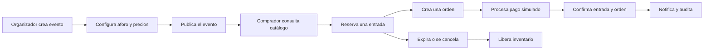

# Backlog de historias de usuario — SeatForge

Este directorio convierte la **Etapa 1 (monolito modular)** del `ROADMAP.md` en un backlog orientado al aprendizaje avanzado de backend.

## Alcance

- Una sola aplicación Spring Boot desplegable.
- Monolito modular con módulos `identity`, `events`, `inventory`, `orders`, `payments`, `notifications`, `audit` y `shared`.
- Arquitectura hexagonal dentro de cada módulo.
- Screaming Architecture: los paquetes y casos de uso expresan el negocio, no el framework.
- DDD pragmático: agregados, value objects, eventos de dominio y lenguaje ubicuo.
- PostgreSQL como fuente de verdad.
- Pruebas de concurrencia, integración y carga desde el inicio.
- Métricas, trazas y logs suficientes para comparar alternativas técnicas.

## Fuera de alcance de esta fase

- Separación física en microservicios.
- Kafka, Redis, Kubernetes, service mesh y consistencia entre bases de datos.
- Proveedor de pagos real o almacenamiento de tarjetas.
- Analítica avanzada.
- Interfaz gráfica completa.

Los límites modulares deben permitir una extracción futura, pero no se introducirán llamadas HTTP internas ni infraestructura distribuida prematuramente.

## Convenciones

### Prioridad

- **P0:** indispensable para recorrer el flujo de compra o proteger la integridad.
- **P1:** indispensable para los objetivos de aprendizaje y operación.
- **P2:** mejora posterior dentro de la fase del monolito.

### Tipos de prueba

- **U:** unitaria de dominio o caso de uso.
- **I:** integración con adaptadores reales y PostgreSQL/Testcontainers.
- **C:** concurrencia.
- **F:** fallo controlado o recuperación.
- **P:** rendimiento/carga.
- **S:** seguridad.
- **O:** observabilidad.

### Definition of Done común

Además de los criterios específicos de cada archivo:

1. Regla de negocio cubierta por pruebas unitarias.
2. Adaptadores principales cubiertos por pruebas de integración con Testcontainers cuando aplique.
3. Errores expuestos con un formato HTTP consistente y sin filtrar detalles internos.
4. Logs estructurados con `traceId` y los identificadores de negocio disponibles.
5. Métricas de éxito, fallo y latencia del caso de uso.
6. Trazas sin tokens, datos de tarjetas ni información sensible.
7. Documentación OpenAPI de los endpoints.
8. Decisiones no triviales documentadas mediante ADR.
9. No existen dependencias desde dominio hacia Spring, JPA, HTTP o mensajería.
10. La suite automatizada es determinista y pasa en CI.

## Orden sugerido

| Orden | ID | Historia | Prioridad |
|---:|---|---|---|
| 1 | [US-001](US-001-monolito-modular.md) | Establecer el monolito modular hexagonal | P0 |
| 2 | [US-002](US-002-identidad-y-autorizacion.md) | Integrar identidad y autorización | P0 |
| 3 | [US-003](US-003-crear-evento.md) | Crear un evento | P0 |
| 4 | [US-004](US-004-configurar-aforo-y-precios.md) | Configurar zonas, asientos y precios | P0 |
| 5 | [US-005](US-005-publicar-y-cancelar-evento.md) | Publicar o cancelar un evento | P0 |
| 6 | [US-006](US-006-consultar-catalogo.md) | Consultar catálogo y detalle | P0 |
| 7 | [US-007](US-007-registrar-inventario.md) | Generar el inventario vendible | P0 |
| 8 | [US-008](US-008-reservar-entrada.md) | Reservar temporalmente una entrada | P0 |
| 9 | [US-009](US-009-liberar-reservas-expiradas.md) | Liberar reservas expiradas | P0 |
| 10 | [US-010](US-010-crear-orden-idempotente.md) | Crear una orden idempotente | P0 |
| 11 | [US-011](US-011-simular-pago.md) | Procesar un pago simulado | P0 |
| 12 | [US-012](US-012-confirmar-compra.md) | Confirmar compra e inventario | P0 |
| 13 | [US-013](US-013-cancelar-compra.md) | Cancelar y compensar una compra | P0 |
| 14 | [US-014](US-014-notificar-resultado.md) | Notificar el resultado de compra | P1 |
| 15 | [US-015](US-015-auditar-operaciones.md) | Auditar operaciones críticas | P1 |
| 16 | [US-016](US-016-comparar-control-concurrencia.md) | Comparar estrategias de concurrencia | P0 |
| 17 | [US-017](US-017-observabilidad-base.md) | Observar el flujo de extremo a extremo | P1 |
| 18 | [US-018](US-018-pruebas-carga-monolito.md) | Ejecutar perfiles de carga reproducibles | P1 |

## Flujo mínimo

